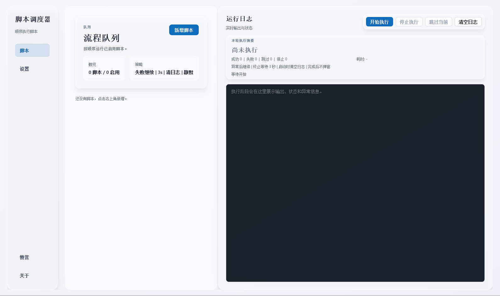

# Auto-Script

Auto-Script 是一个基于 `Python` 和 `PySide6` 开发的 Windows 桌面工具，用于按顺序执行多个外部脚本或程序，并实时查看运行日志和结果。

## 运行截图



## 运行环境

- Windows
- Python 3.12+
- 依赖见 [requirements.txt](/d:/Code/Auto-Script/requirements.txt)

## 启动方式

```powershell
.\run.ps1
```

或直接使用项目虚拟环境解释器：

```powershell
.\.venv\Scripts\python.exe main.py
```

说明：如果系统里的 `python` 命令仍跳到 Microsoft Store，占位符还在生效，直接使用上面的项目内启动方式即可。

首次启动时，如果当前不是管理员权限，程序会在 Windows 上请求 UAC 提升后再继续运行。这是为了兼容需要管理员权限的自动化工具和游戏辅助程序。

## 使用流程

1. 打开应用后，在“脚本”页点击“新增脚本”。
2. 输入脚本名称，选择程序路径，按需填写启动参数。
3. 如需限制脚本最长运行时间，可在“运行超时”输入数字；该数字单位为秒，默认 `600`（10 分钟），`0` 表示不限制。
4. 如脚本真正运行时会另起进程，可在“脚本进程名”填写实际常驻的进程名（例如 `BetterGI.exe`）。
5. 如需按“游戏关闭”来判定结束，可在“监测游戏关闭进程”填写进程名（例如 `GenshinImpact.exe`），并把“完成判定”设为“游戏进程关闭”。
6. 如需在任务结束时顺手关闭脚本工具或游戏，可打开“结束后关闭脚本”或“结束后关闭游戏”开关。
7. 使用每张脚本卡片右上角的拨杆控制是否启用。
8. 需要调整顺序时，点击“上移 / 下移”。
9. 点击“开始执行”后，程序会按当前卡片顺序运行所有已开启脚本。
10. 运行中可使用“停止执行”或“跳过当前”。
11. 右侧“运行日志”会实时显示输出；上方“本轮执行摘要”会显示结果统计。

## 设置页说明

- `异常后继续执行后续脚本`
  控制脚本失败后是否继续执行后续任务。
- `开始执行时自动清空日志`
  控制每轮执行开始前是否清理旧日志。
- `执行结束后弹出结果提示`
  控制完成后是否额外弹出提示框。
- `终止等待`
  停止或跳过当前脚本时，等待进程正常退出的秒数；超时后会强制结束。

## 配置文件

- 默认配置文件路径：`data/config.json`
- 会保存：
  - 脚本列表
  - 启用状态
  - 执行顺序
  - 窗口大小
  - 全局运行设置

## 当前范围

当前版本聚焦首版可用闭环，暂未包含：

- 运行历史记录
- 失败重试
- 超时策略模板
- 前后置延迟
- 安装包 / 打包产物
